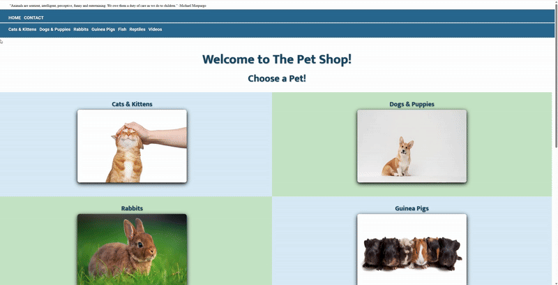

# The Pet Shop – Website

A playful, image-driven website showcasing different types of pets, with quick navigation, interactive galleries, and embedded video content. Built to practice layout, styling, and user interaction in a simple multi-page format.

## Features

- Navigation Bar linking to homepage, contact page, and pet categories

- Pet Gallery with sections for cats, dogs, rabbits, guinea pigs, fish, and reptiles

- Hover Overlay Effects on images

- Animated Header Text

- Embedded YouTube Video

- Footer with Contact Information

